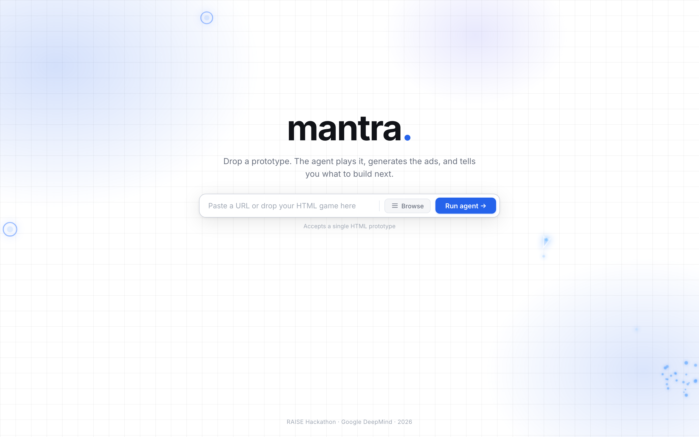
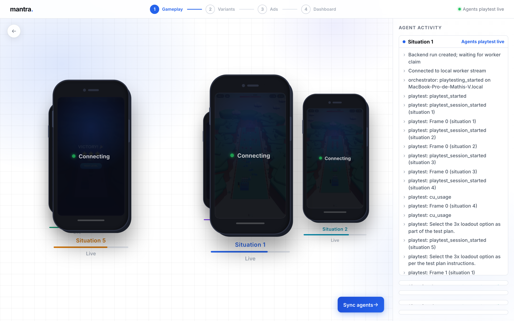
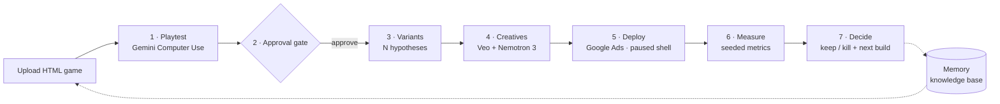
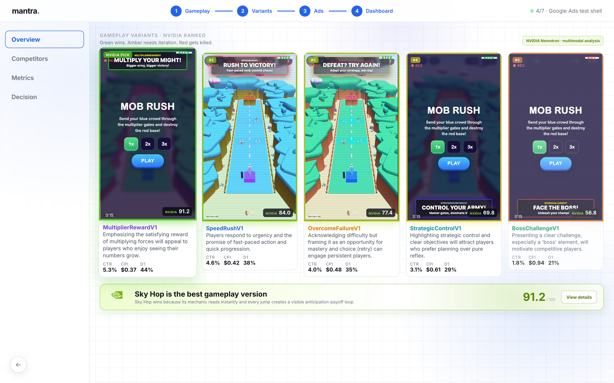
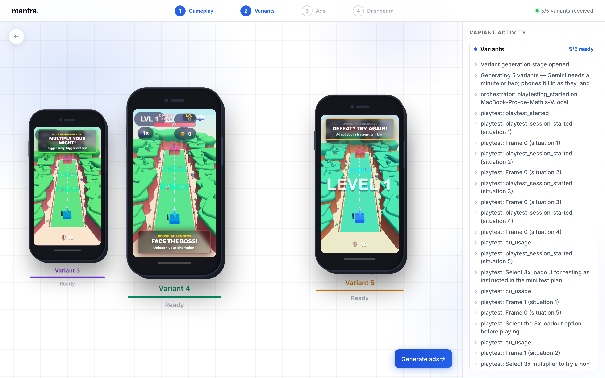
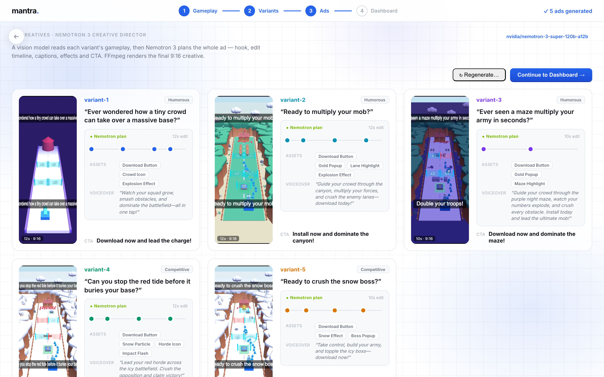

# MANTRA  
*RAISE Hackathon — Google DeepMind in-person track · 2026*


---

## Concept

Hypercasual studios burn real money discovering that a prototype isn't fun. Today a human has to play each build, judge it, cut the creatives, and read the metrics — and most prototypes die anyway. The judgment that matters most **"is this going to make people click?"** — happens through **play**, not
through instrumentation.

**Mantra** moves that kill decision **before the ad spend**. An autonomous agent plays the game the way a real player would  visually, through the screen, with zero privileged access to game state and returns a player's verdict. That verdict is what makes the rest of the pipeline worth trusting, so Mantra keeps going and closes the whole creative-testing loop:

> **Upload an HTML prototype → the agent plays it → variants → ad videos → deploy → metrics →
> keep / kill → what to build next.** A knowledge base compounds across projects.



---


## Key Features


| Feature                             | Description                                                                                                                                                                                  |
| ----------------------------------- | -------------------------------------------------------------------------------------------------------------------------------------------------------------------------------------------- |
| **Play-based fun verdict**          | Gemini Computer Use plays the prototype end to end through the screen and returns a player's verdict on whether it's fun. This is the load-bearing primitive; everything else layers on top. |
| **5-way parallel playtest**         | One run fans out into five Computer Use sessions, each playing a different level (`?level=N`), streamed live into an iPhone-framed carousel with action captions and a cursor overlay.       |
| **Variant generation**              | N mutated versions of the game, each testing an explicit design hypothesis — mounted live in sandboxed iframes as they land.                                                                 |
| **AI ad creatives**                 | Veo plus a Nemotron 3 creative director turn gameplay into 9:16 ad videos, each with a hook, tone, CTA, and an editable EDL timeline.                                                        |
| **NVIDIA multimodal ranking**       | Nemotron 3 evaluates full gameplay recordings with embedded audio; deterministic code ranks variants with **visible weights (45% video · 30% color · 25% audio)** — no opaque AI winner.     |
| **Real Google Ads writes**          | Creates a campaign shell and links a demo image in a verified test child — genuine API writes, no serving and no billing.                                                                    |
| **Keep / kill + next build**        | A per-creative decision plus a next-build recommendation, backed by a knowledge base that compounds across runs.                                                                             |
| **Realtime single source of truth** | Supabase (Postgres) holds all pipeline state and events; the dashboard subscribes over realtime. If the dashboard can't see it, it didn't happen.                                            |




---


## How It Works

Mantra is a hand-rolled state machine. `RunStatus` and `RUN_TRANSITIONS` in
`src/contracts/types.ts` define every legal step; the approval gate is the only edge the
dashboard advances.




- **Playtest** (`src/nodes/playtest/`, the star) — Gemini Computer Use drives a real headless
Chromium; five parallel level sessions merge into one report, streamed live over SSE.
- **Variants** (`src/nodes/variants.ts`) — copies `game_html` and mutates it into hypothesis-driven variants.
- **Creatives** (`src/nodes/creatives.ts`) — Veo ad videos generated because the playtest ran.
- **Ads** (`src/nodes/ads.ts`) — paused Google Ads campaign shell (real writes) + seeded metrics.
- **Decide** (`src/nodes/decide.ts`) — keep / iterate / kill and the next-build recommendation.
- **NVIDIA analysis** (`src/nodes/nvidia-analysis/`) — Nemotron 3 multimodal ranking with visible weights.

The long-running work (orchestrator + playtest) runs in `npm run worker` on a laptop; Vercel
hosts the dashboard and API. Both sides talk only to Supabase.



---


## The Dashboard

The demo UI (`frontend/`, Vite) is a stepper across five screens:

- **Landing** — drop a URL or an HTML prototype and run the agent.
- **Situation carousel** — five iPhone-framed cards, one per parallel Computer Use agent, with a LIVE pill, streamed frames, action captions, and a grouped activity log.
- **Variants** — the generated variants mounted live in sandboxed iframes, each with its name and hypothesis.
- **Ad creatives** — a grid of hover-to-play 9:16 videos with hook, tone, CTA, and the Nemotron plan (EDL timeline, assets, voiceover).
- **Dashboard** — tabs for Overview (NVIDIA-ranked variants + keep/kill), Competitors (interactive globe benchmark), Metrics (seeded market intelligence), and Decision (the Google Ads "launch safely" card).





---


## Tech Stack


| Layer             | Choice                                                                                     |
| ----------------- | ------------------------------------------------------------------------------------------ |
| App               | Single Next.js app (App Router, React 19, TypeScript strict) — dashboard + API + all nodes |
| Demo UI           | Separate Vite app in `frontend/` (vanilla TS + Three.js + cobe globe)                      |
| Long-running work | `npm run worker` (tsx) on a laptop — Playwright / Computer Use can't run on Vercel         |
| State + realtime  | Supabase (Postgres) — single source of truth; dashboard subscribes via realtime            |
| Playtest          | Playwright + Gemini Computer Use (`@google/genai`)                                         |
| Creatives         | Veo via `@google/genai` + a Nemotron 3 creative director (NVIDIA NIM)                      |
| Ranking           | NVIDIA Nemotron 3 multimodal comparison with fixed, visible weights                        |
| Ads               | Google Ads API via `google-auth-library` (paused shell only)                               |
| Validation        | Zod — every request body, env var, and LLM/Veo output parsed at the boundary               |
| Styling           | Tailwind CSS 4                                                                             |
| Deploy            | Vercel (dashboard + API); worker stays local for the demo                                  |


---


## Getting Started


### Prerequisites

- Node.js **≥ 22** and npm
- `npx playwright install chromium` (once — for the playtest node)
- A Supabase project with `supabase/schema.sql` applied in the SQL editor
- API keys: Gemini, NVIDIA NIM, Supabase, and a Google Ads **test** child account


### Installation

```bash
npm install
npm --prefix frontend install
npx playwright install chromium   # once, for the playtest node
cp .env.example .env              # then fill in your keys — every var is documented in .env.example
```


### Run Locally

One command brings up the whole stack (kills stale port holders, then starts everything in
order with health checks; logs land in `/tmp/mantra-*.log`):

```bash
npm run stack            # start everything: api → game → ui → pubgen → worker
npm run stack -- --down  # stop the stack
```


| Service                                      | Command                                                         | Port |
| -------------------------------------------- | --------------------------------------------------------------- | ---- |
| Dashboard + API (Next.js)                    | `npm run dev`                                                   | 3000 |
| Game dev server (Three.js Mob Control clone) | `npm run game`                                                  | 5173 |
| Demo UI (Vite)                               | `npm --prefix frontend run dev -- --host 127.0.0.1 --port 5175` | 5175 |
| Ad generator (pub-generator)                 | `npm --prefix frontend run pubgen`                              | 4319 |
| Worker (orchestrator + nodes, live stream)   | `npm run worker`                                                | 4317 |


> **Exactly one worker across the whole team.** Supabase is shared, so any running worker claims
> runs for everyone. Port 4317 is the mutex — a second `npm run worker` fails fast. Restart the
> worker after any change under `src/nodes/`, `src/orchestrator/`, or `src/worker/` (no hot reload).

Other commands: `npm run typecheck`, `npm run lint`, `npm run build`, and
`npm run nvidia:compare -- input.json` (compare 2–6 gameplay recordings).

---


## Demo

The pitch is roughly one minute, in four beats:

1. **Problem** (15s) — studios burn money finding out prototypes aren't fun.
2. **The agent plays** (25s, the wow) — pre-recorded and sped up: Computer Use plays the game live, then produces a player's report.
3. **Variants + videos** (15s) — mutated builds and their Veo ad creatives.
4. **Dashboard + decision** (15s, live) — NVIDIA ranking, seeded metrics, keep / kill, and the paused Google Ads shell.


Demo video: [watch here](https://www.youtube.com/watch?v=0yRIkQtd0lo&feature=youtu.be) 

---


## Team


| Name            | Contact                                                        |
| --------------- | -------------------------------------------------------------- |
| Noé             | [https://github.com/NoeBrt](https://github.com/NoeBrt)         |
| Romain          | [https://github.com/RomaGab](https://github.com/RomaGab)     |
| Tom             | [https://github.com/Tooom123](https://github.com/Tooom123)     |
| Aymen           | [https://github.com/aymen-elo](https://github.com/aymen-elo)   |
| Mathis Villaret | [https://github.com/Mathis-14](https://github.com/Mathis-14)   |

---

